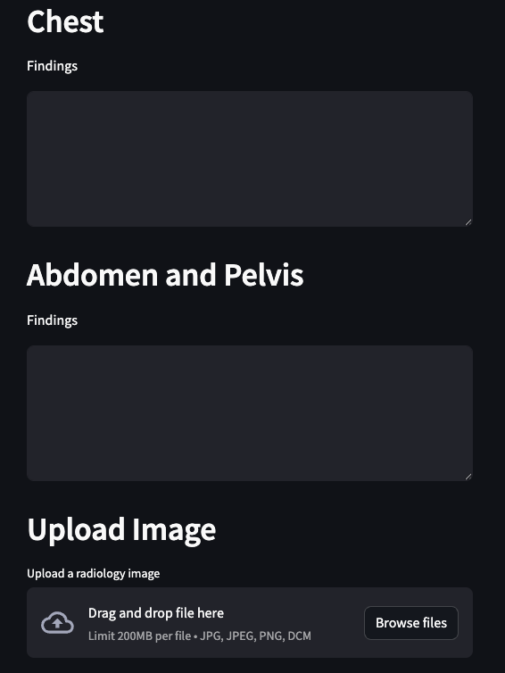

# RadReport AI

## AI-Powered Multimodal Radiology Report Generator

RadReport AI is a sophisticated web application that automatically generates structured radiology reports from radiologist findings and uploaded images. It combines AI language processing with standardized templates to produce consistent, high-quality reports while saving valuable time for radiologists.

## 🌟 Key Features

- **Study Type Selection**: Support for Chest, Abdomen and Pelvis, or Full Body CT scans
- **Facility-Specific Templates**: Customized technique sections based on facility equipment
- **AI-Enhanced Processing**: Claude AI integration for natural language processing and image analysis
- **Structured Report Generation**: Produces formatted reports with appropriate findings and impressions
- **Image Upload & Analysis**: Optional image upload for AI-assisted analysis
- **Intelligent Pattern Matching**: Maps findings to appropriate impressions using pattern database
- **Continuous Improvement**: Logs unmatched findings for ongoing system enhancement

## 📋 Screenshots



## 🚀 Getting Started

### Prerequisites

- Python 3.8+
- Supabase account
- Anthropic Claude API key

### Installation

1. Clone the repository
   ```bash
   git clone https://github.com/quantnexusai/radreport-ai.git
   cd radreport-ai
   ```

2. Create and activate virtual environment
   ```bash
   python -m venv venv
   source venv/bin/activate  # On Windows: venv\Scripts\activate
   ```

3. Install dependencies
   ```bash
   pip install -r requirements.txt
   ```

4. Create a `.env` file with your API keys
   ```
   SUPABASE_URL=your_supabase_url
   SUPABASE_KEY=your_supabase_key
   CLAUDE_API_KEY=your_claude_api_key
   ```

5. Run the application
   ```bash
   streamlit run app.py
   ```

## 💻 Usage

1. **Select Study Type**: Choose between Full Body, Chest, or Abdomen and Pelvis
2. **Choose Facility**: Select the imaging facility where the scan was performed
3. **Enter Findings**: Input the radiologist's findings in the relevant sections
4. **Upload Image (Optional)**: Add a CT scan image for additional AI analysis
5. **Generate Report**: Click the generate button to create a structured report
6. **Review & Download**: Review the generated report and download as needed

## 🔧 Administrator Functions

The system includes an admin panel (password protected) with the following capabilities:

- **Template Management**: Modify facility-specific technique sections
- **Impression Pattern Database**: Add and edit pattern-to-impression mappings
- **Unmatched Findings**: Review findings that didn't match existing patterns and add new patterns based on them

## 🧠 How It Works

1. **Input Processing**: The system processes the selected study type, facility, and entered findings
2. **Template Selection**: Appropriate templates are retrieved based on study type and facility
3. **Finding Processing**: Claude AI corrects grammar and formats findings
4. **Category Matching**: Each finding is matched to the appropriate category in the template
5. **Impression Generation**: The system matches findings to appropriate impressions using pattern matching
6. **Image Analysis (Optional)**: If an image is provided, Claude analyzes it for additional findings
7. **Report Assembly**: All components are combined into a complete, structured report

## 📊 Future Enhancements (Version 2)

- DICOM image processing
- Integration with hospital PACS/RIS systems
- Enhanced AI analysis
- Customizable report templates
- Historical report comparison
- Advanced analytics dashboard

## 🛠️ Technology Stack

- **Frontend**: Streamlit
- **Database**: Supabase
- **AI Processing**: Anthropic Claude API
- **Deployment**: Streamlit Cloud
- **Version Control**: Git/GitHub

## 📄 License

This project is proprietary and confidential. All rights reserved.

## 👤 Contact

For questions or support, please contact ari@quantnexus.ai.